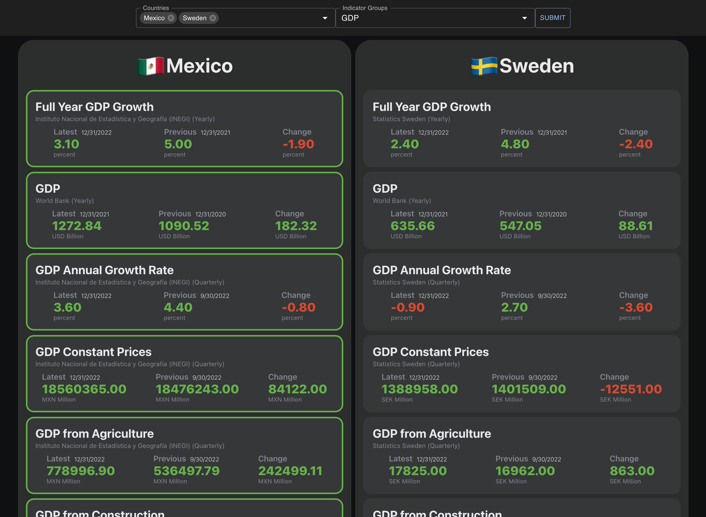
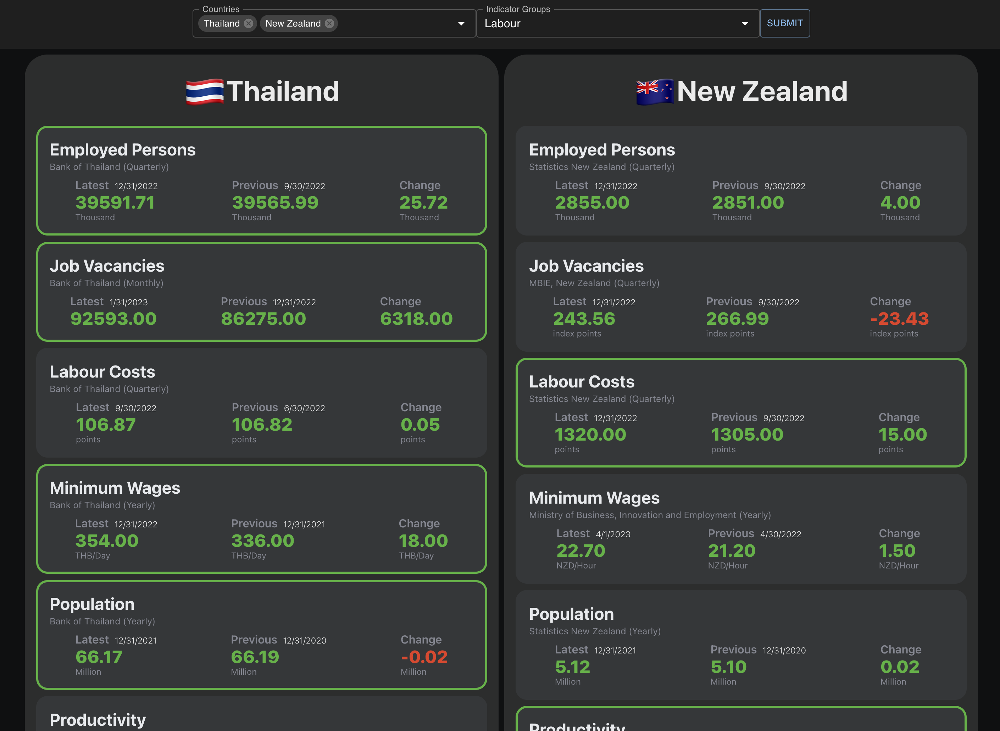

# TE Comparator

This is a web application that allows you to compare seleceted countries by indicators provided by the TE API.

Here are some examples of output:




## Running the app

In order to get the app running, first start the server by running 
```
node server/server.js
```

Then, start the front-end application by running
```
npm start
```

